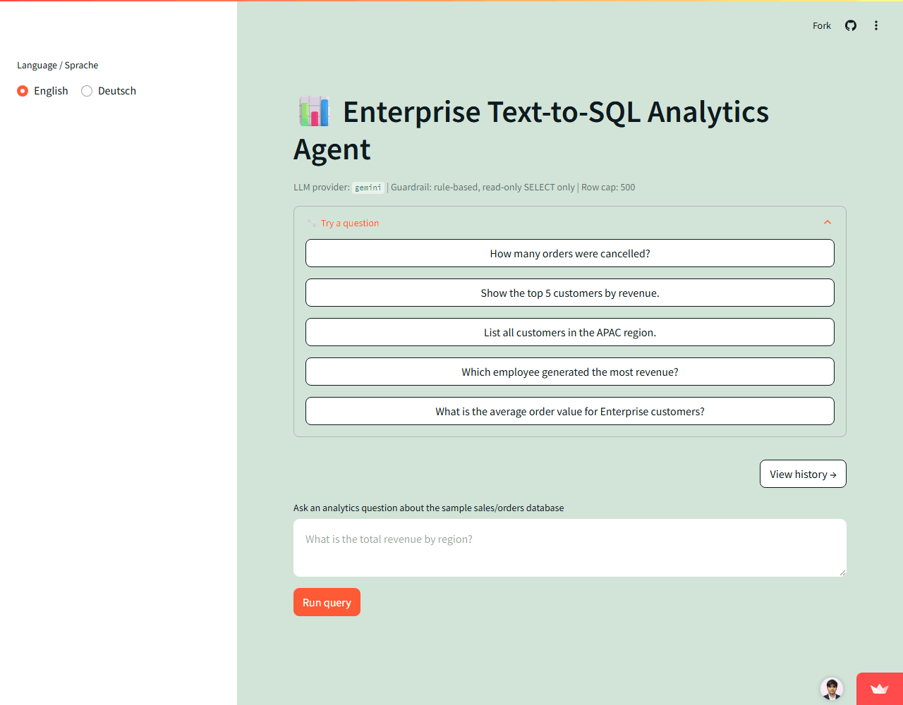

# QueryMind

Turns plain-English analytics questions into guardrailed, read-only SQL against Postgres — executes it safely, returns results plus a summary.

**Live demo:** https://enterprise-text-to-sql-analytics-agent.streamlit.app/ *(free-tier Streamlit, ~30s cold start)*




## Results

| Check | Result |
|---|---|
| Overall accuracy (60-question benchmark) | **91.7%** (55/60) |
| — simple lookups | 100% |
| — aggregations | 96.7% |
| — joins (hardest category) | 73.3% |
| Adversarial prompts blocked | **48/48** |
| Guardrail latency | avg 0.10ms, max 2.85ms |
| Load test (150 users): throughput / p50 latency | +50.6% RPM / -51.6% |

## How it works

```
NL question → schema-aware retrieval → SQL generation (LLM or offline mock)
            → guardrail (sqlglot parse, read-only, allow-list, row cap)
            → execute → JSON + NL summary
```

Guardrail is a hand-written rules engine, not an LLM-in-the-loop (NeMo etc.) — it has to add near-zero latency, and an LLM rail can't hit that. `LLM_PROVIDER=mock` (default) runs a $0 offline parser so every benchmark number above is reproducible without an API key; switch to `anthropic` or `gemini` for the real LLM path.

**Known gap:** the live demo's query execution currently fails — the free-tier Supabase Postgres it points at is asleep (auto-pauses on inactivity). Guardrail and SQL generation both run for real; only execution is affected, and it's surfaced to the user as-is rather than hidden.

## Run it

```bash
pip install -r requirements.txt && cp .env.example .env
docker compose up -d postgres redis && python db/seed.py
uvicorn app.main:app --reload   # http://localhost:8000/docs

python tests/accuracy/run_accuracy.py --provider mock   # reproduce the accuracy numbers
python tests/safety/run_safety_test.py --provider mock  # reproduce the guardrail numbers
```

Full architecture, guardrail rule list, and every benchmark's methodology are documented in [`docs/DETAILS.md`](docs/DETAILS.md).
