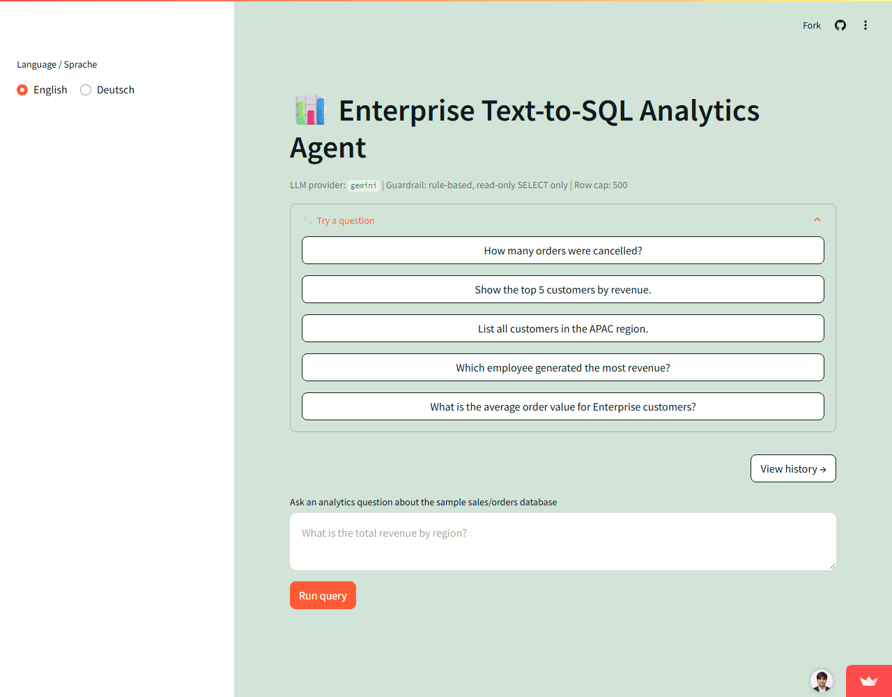

# QueryMind

Turns plain-English analytics questions into guardrailed, read-only SQL against Postgres — executes it safely, returns results plus a summary.

**Live demo:** https://enterprise-text-to-sql-analytics-agent.streamlit.app/ *(free-tier Streamlit, ~30s cold start)*




## Results

| Check | Result |
|---|---|
| Overall accuracy, offline rule-based parser (74 questions) | 91.9% (68/74); fitted to this schema and these questions, so a ceiling for hand-built parsing, not LLM accuracy |
| Overall accuracy, **real LLM** (Qwen2.5-1.5B-Instruct, local, greedy, same prompt and guardrail) | **68.9%** (51/74): simple 75%, aggregations 69%, joins 60% |
| — sales schema only (60 questions) | 91.7% (55/60): simple 100%, aggregations 96.7%, joins 73.3% |
| — wallet-risk schema (14 questions) | 92.9% (13/14); written by the parser's author, so optimistic |
| Adversarial prompts blocked | **48/48** |
| Guardrail latency | avg 0.10ms, max 2.85ms |
| Load test (150 users): throughput / p50 latency | +50.6% RPM / -51.6% |

### Which number to trust

The 91.9% measures a rule-based parser written against this very schema and question set, so it says little about how the agent generalises. The 68.9% is a
small open model answering the same questions from the same schema prompt (`--provider local`, reproducible with no API key on a 6 GB GPU). The guardrail
layer runs identically in both cases. A larger model should score higher, and `--provider groq` runs Llama 3.3 70B on Groq's free tier
(`GROQ_API_KEY=... python tests/accuracy/run_accuracy.py --provider groq`; that number has not been measured yet). Real-LLM runs write
`reports/accuracy_report_<provider>.json` and never overwrite the mock report.

## Wallet risk (absorbs the former ChainScore and WalletGuard repos)

A second domain next to the sales schema: **Aave V2 wallets on Polygon**. `ml/wallet_features.py` turns 100,000 real
transactions into point-in-time features per borrower (only transactions before a cutoff), and
`ml/evaluate_wallet_risk.py` trains and tests forward in time against **real liquidations** (train on June, test on
July onward; 1,247 borrowers, 36 liquidated, 2.9% base rate). Results (`docs/wallet_risk_eval.md`):

| Scorer | ROC-AUC (95% CI) |
|---|---|
| random | 0.52 (0.42 to 0.63) |
| ChainScore's heuristic score (on USD values) | 0.55 (0.45 to 0.65) |
| WalletGuard-style heuristic | 0.53 (0.45 to 0.62) |
| "was liquidated before" rule | 0.70 (0.59 to 0.81) |
| logistic regression (served) | 0.71 (0.62 to 0.80) |
| random forest | 0.79 (0.70 to 0.87) |

The two original hand-weighted scores are no better than chance at predicting liquidations. The old ChainScore
R-squared of 0.45 measured how well a forest recovers its own hand-made score, which is circular. With 36 positives
the intervals overlap, so "forest beats logistic" is not established; the logistic model is served because it needs no
ML runtime. Data: the 91 MB Aave file linked from the old ChainScore README (third-party, not committed).

- **Postgres:** `wallets` table (1,625 borrowers, features + `risk_score` + `risk_band`), loaded by `db/seed.py`; ask in plain English ("how many wallets are in the high risk band?", "top 5 wallets by borrowed amount").
- **`POST /score`:** features in, risk score 0-1000, band and probability out. Pure-Python serving of an exported logistic model (`app/risk/model.json`); validated inputs; relative risk, not a calibrated default rate.
- `pip install -r requirements-ml.txt` and `python ml/evaluate_wallet_risk.py <transactions.json>` reproduce the table.

## How it works

```
NL question → schema-aware retrieval → SQL generation (LLM or offline mock)
            → guardrail (sqlglot parse, read-only, allow-list, row cap)
            → execute → JSON + NL summary
```

Guardrail is a hand-written rules engine, not an LLM-in-the-loop (NeMo etc.) — it has to add near-zero latency, and an LLM rail can't hit that. `LLM_PROVIDER=mock` (default) runs a $0 offline parser so every benchmark number above is reproducible without an API key; switch to `anthropic` or `gemini` for the real LLM path.

**Known gap:** the live demo's query execution currently fails — the free-tier Supabase Postgres it points at is asleep (auto-pauses on inactivity). Guardrail and SQL generation both run for real; only execution is affected, and it's surfaced to the user as-is rather than hidden.

## Run it

```bash
pip install -r requirements.txt && cp .env.example .env
docker compose up -d postgres redis && python db/seed.py
uvicorn app.main:app --reload   # http://localhost:8000/docs

python tests/accuracy/run_accuracy.py --provider mock   # reproduce the accuracy numbers
python tests/safety/run_safety_test.py --provider mock  # reproduce the guardrail numbers
```

Full architecture, guardrail rule list, and every benchmark's methodology are documented in [`docs/DETAILS.md`](docs/DETAILS.md).

## Test coverage

54 unit tests, **61% line coverage** of `app/` (CI fails below 55%). The Anthropic, Gemini and Groq providers need API keys and the local provider needs a GPU, so those are exercised only by the benchmark scripts.
